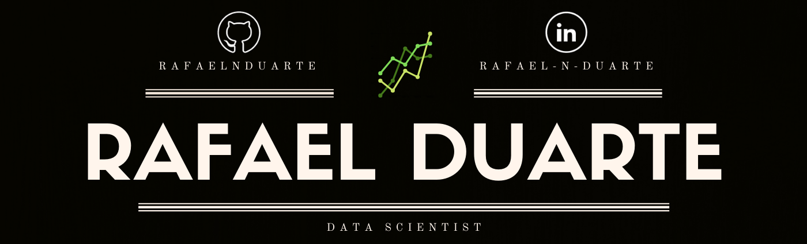

   

# Cerrado Basquete

  

> Repository dedicated to my work with the basketball team Cerrado Basquete. The goal is to provide insights and Data Science solutions that can help the team make better decisions from a tactical, technical, and business perspective.

  

